<h1> CE2019_LAB4_30_31</h1>
<h4>Graph Data Structure Implementaion Using Adajcency Matrix & Random Graph Generation</h4>

<h5> Screen Shots <h5>

    Screen Shots of Random Graph Generation!
    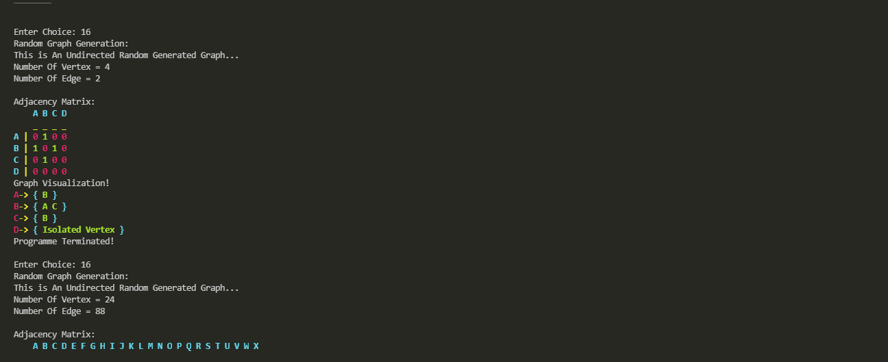
    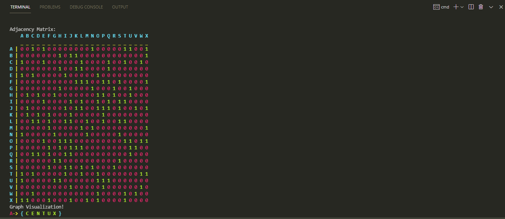
    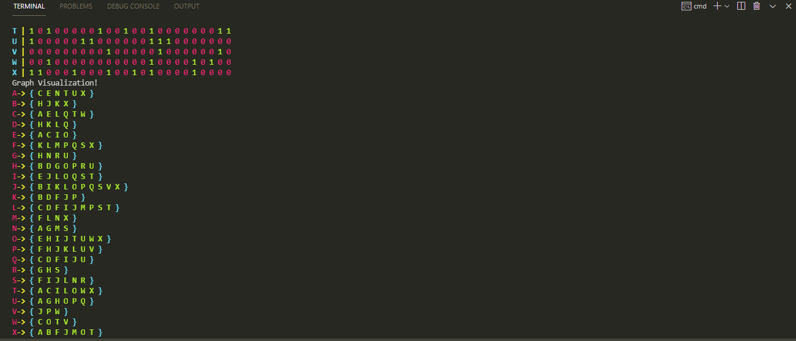
    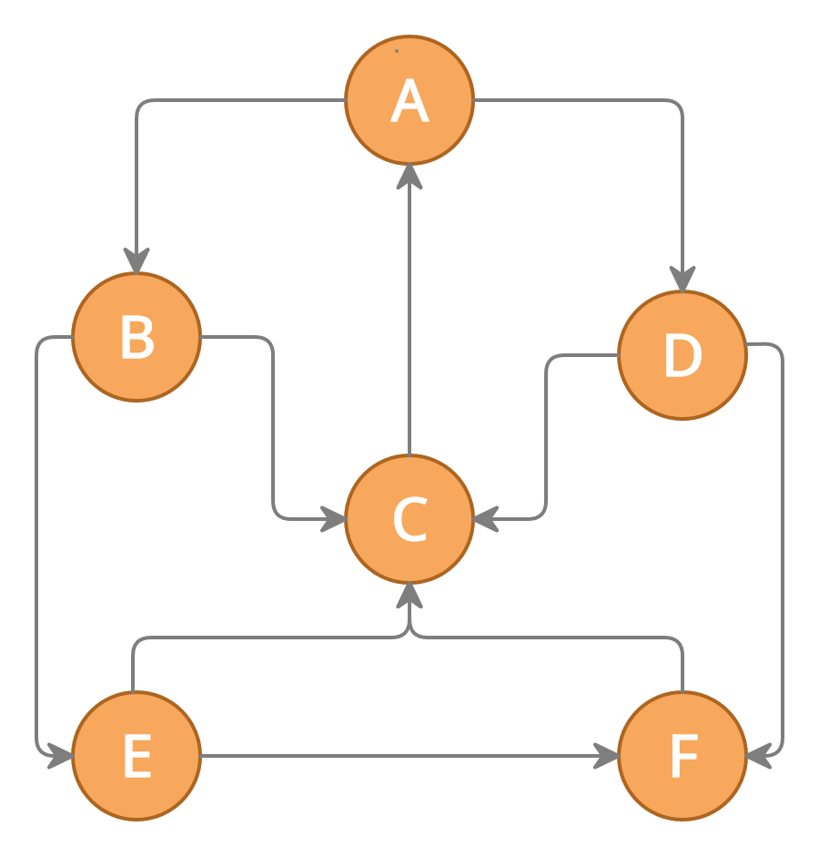
    <h3>Fig 1: An Example of Directed Graph</h3>

<h6>Implementing Above Graph  with the following given below operations<h6>

1. Implemented graph data structure with the following operations:

(a) isEmpty(): Returns true if the graph is empty, and false otherwise

(b) isDirected(): Returns true if the graph is directed, and false otherwise

(c) addVertex(newVertex): Inserts a new vertex to the graph

(d) addEdge(vertex1, vertex2): Adds an edge from vertex1 to vertex2

(e) removeVertex(vertexToRemove): Remove a vertex from the graph

(f) removeEdge(vertex1, vertex2): Remove an edge from the graph

(g) numVertices(): Returns the number of vertices in the graph

(h) numEdges(): Returns the number of edges in the graph

(i) indegree(vertex): Returns the indegree of a vertex

(j) outdegree(vertex): Returns the outdegree of a vertex

(k) degree(vertex): Returns the degree of a vertex

(l) neighbours(vertex): Returns the neighbours of a vertex

(m) neighbour(vertex1, vertex2): Returns true if vertex2 is a neighbour of vertex1.

Also, written a test program to check the implementation.

2. Bonus: written a program to generate a random graph

<h5>All other Screenshots are here...</h5>

    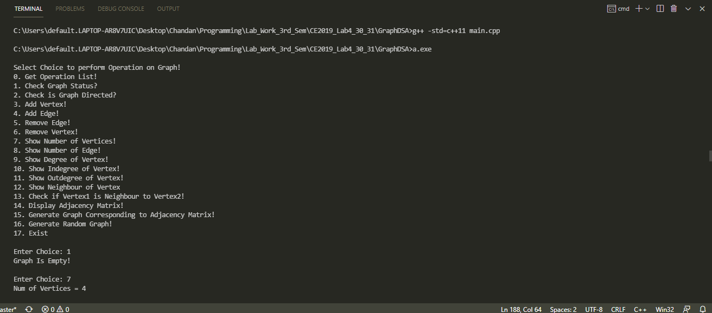
    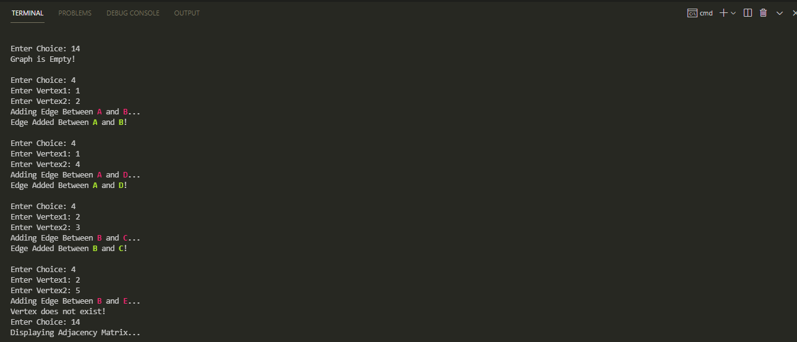
    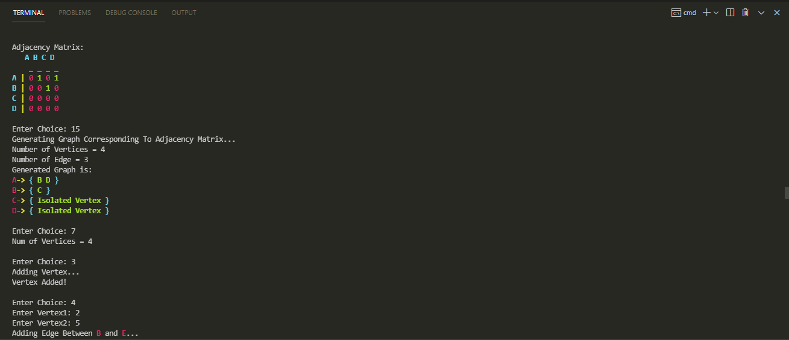
    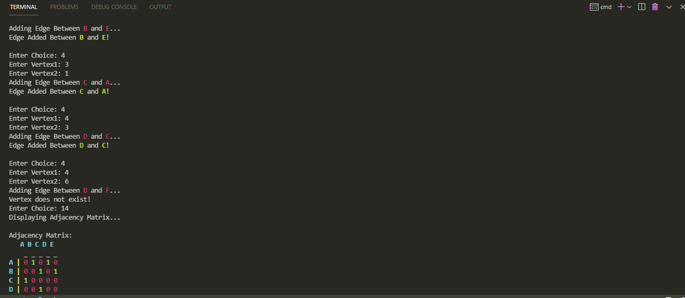
    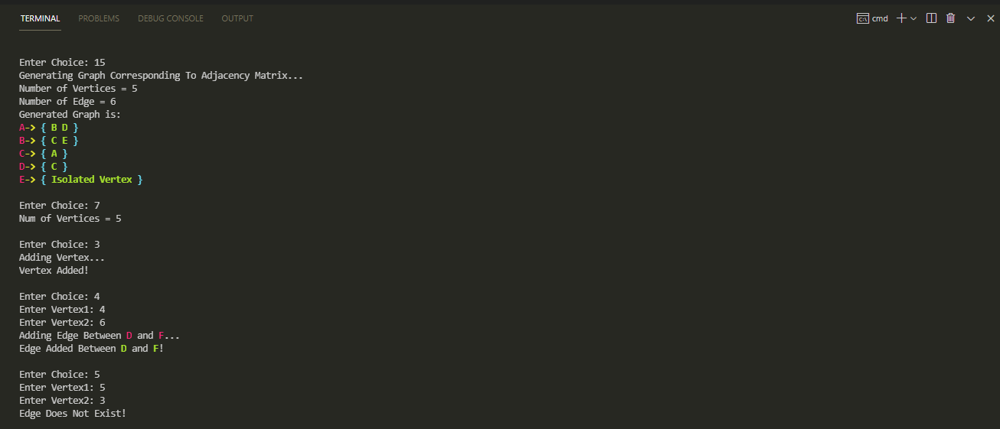
    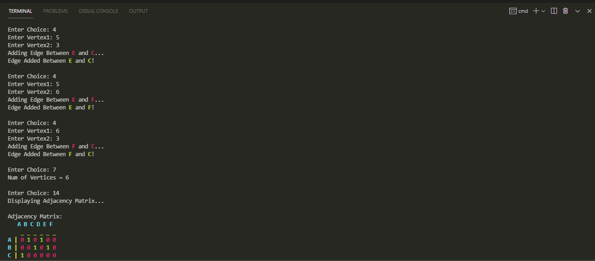
    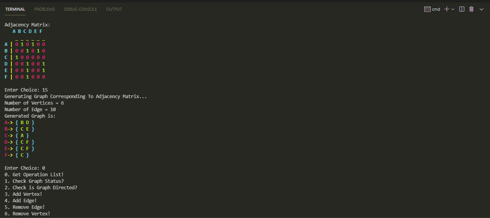
    
The Adjacency Matrix and Graph Visualization in above Screenshot is equivalent to Graph Below.

    
    <h3>Fig 1: An Example of Directed Graph</h3>
     
    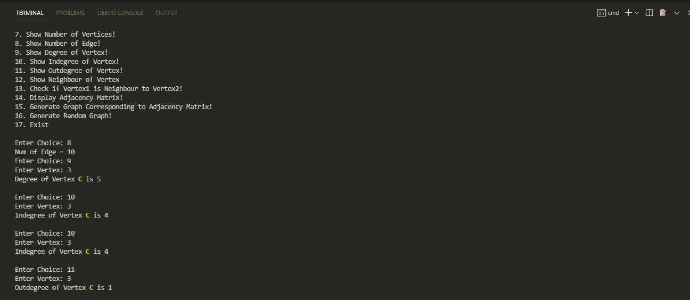
    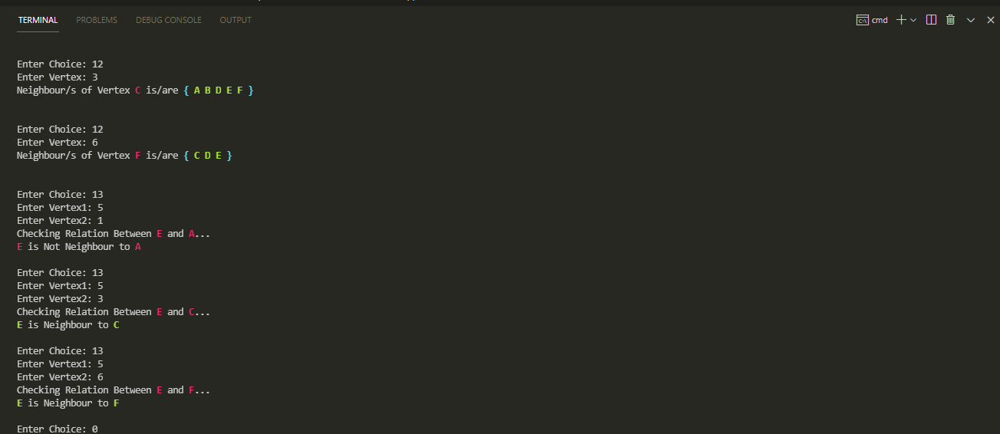
    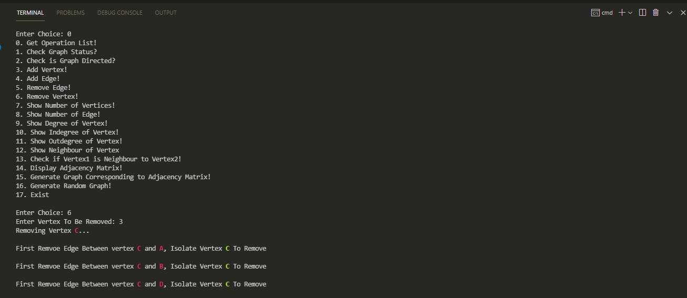
    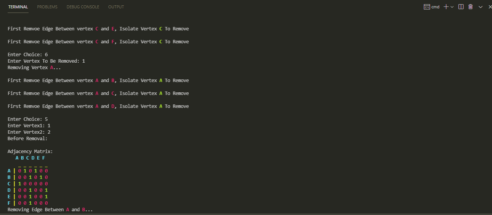
    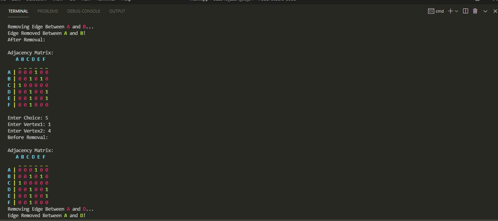
    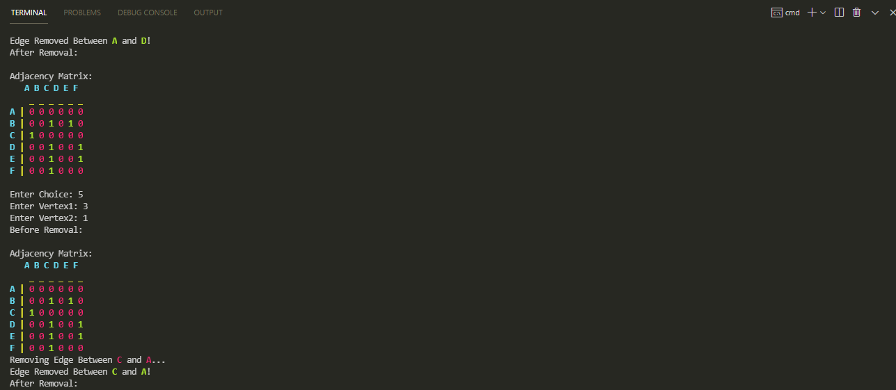
    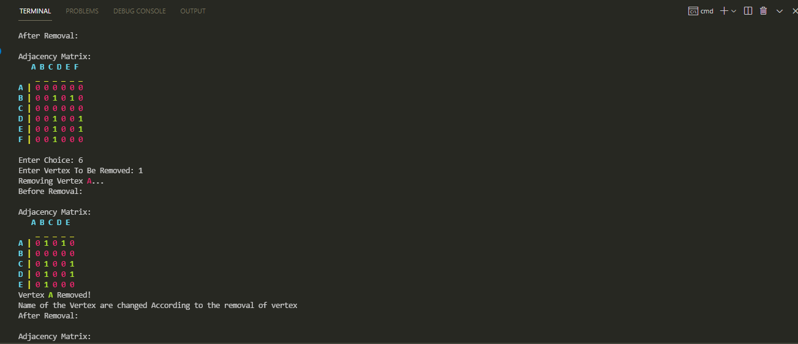
    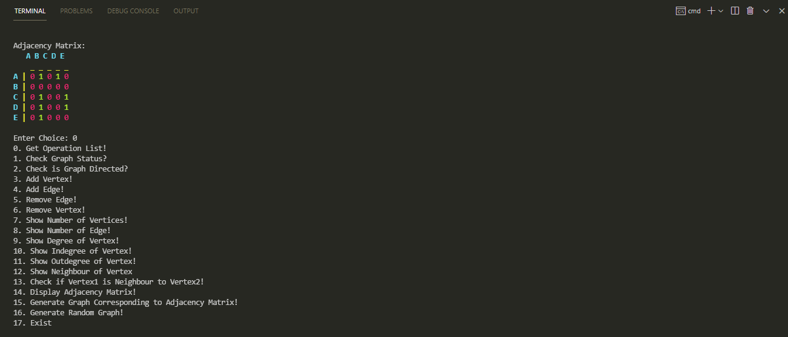
    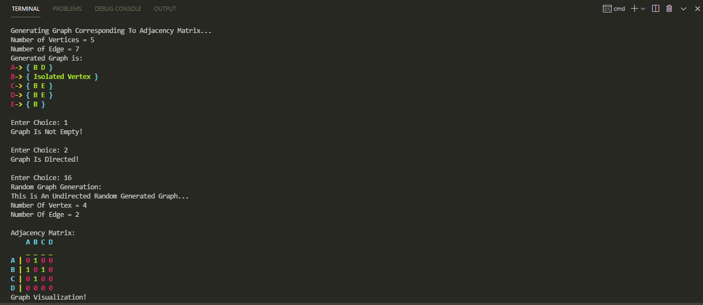
    
    
    
    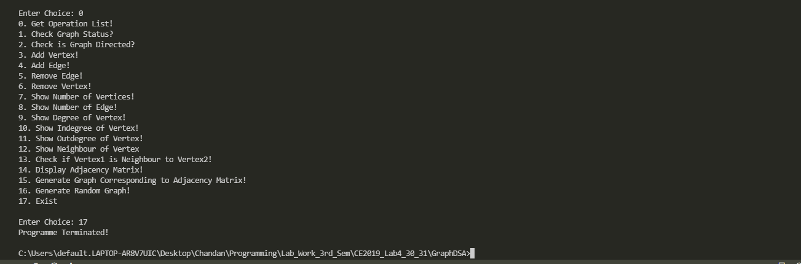

